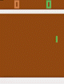

# DQN-Pong
This is an implementation of using Deep Q-learning with memory replay for pong. I wrote a blog post walking through this code and some explanations here: https://medium.com/@ameetrahane_4388/lets-play-pong-bd85a1397c6a

The trained weights and output gif are both in the output folder. Here's the Agent!

